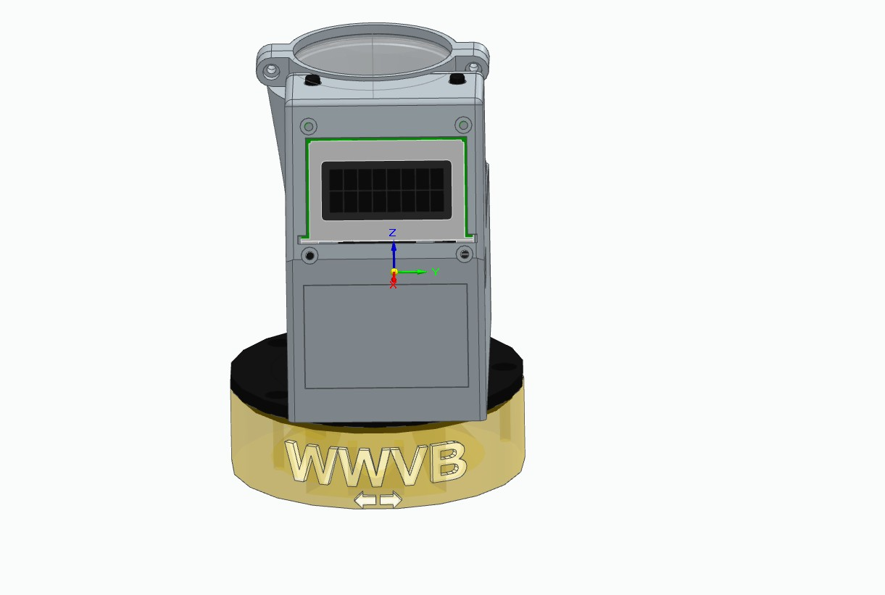

<h2>WWVB Projection Clock</h2>
This is a clock that sets itself to the National Bureau of Standards 60KHz radio station WWVB. 
It displays on an 8 by 2 character LCD display, and it
has an LED ceiling projection through a 38mm diameter, 50mm focal length lens. 

The clock can receive thermometer and/or rainfall gauge readouts using its 900 MHz packet radio chip. A packet gateway 
 can set clock parameters through the packet radio interface. (See https://github.com/w5xd/PacketGateway which 
is part of the bigger project https://github.com/w5xd/diysha/wiki.)

It generally does not ever need to be manually set to the correct time because it continuously listens for the WWVB BPSK signal,
which can be received pretty 
much anywhere in the USA at least part of the day. Without power applied the clock displays nothing while
maintaining its time setting using a CR2032 coin cell backup. The CR2032 has a calculated lifetime of many years. 
Even without the coin cell,
 the clock synchronizes with WWVB as soon as it can decode it, and synchronizes every hour or so
as long as power is applied.

It has a setting that determines how much to shift the UTC time it receives from WWVB to display local time. 
It needs to be set to know whether your locality observes Daylight Savings Time, DST. Locations in Arizona, 
for example, do not.
It monitors the WWVB announcements concerning
whether DST is in effect now, and, many months ahead of a DST switch, announcements of the time and date of the next
switch. Once you have set this clock to your time zone and whether DST is ever used locally, these are committed to EEPROM
and the clock makes all DST changes as commanded by the WWVB announcements. The
clock's two buttons provide access the settings that adjust LED brightness and whether to display its weather readings in metric or 
imperial units.

Most setup parameters can be changed using
the two buttons SW1 and SW2 on top its main box. All setup parameters can be changed through the Teensy's
USB serial port interface. See the .ino file for details about the other settings.

<h2>Powering the clock</h2>
The PCB power connector  mates a 2.1mm x 5.5mm barrel connector. Only up to 5.5V DC can safely be applied to that connector 
(per the <a href='https://www.pjrc.com/teensy/pinout.html#Teensy_4.0'>specification</a> on the Teensy 4.0 module).  
Because wall 
warts are widely available with that 2.1mm x 5.5 mm power connector in various
voltages, many well above 5V, the PCB has a circuit that disconnects the power above about 5.5VDC input. Its best not to test 
that circuit, though,
and only use a 5V wall wart. The clock can 
separately be powered through the micro USB connector integral to the Teensy, but the PCB has no protection for what happens if both
are plugged concurrently&mdash;so don't plug in both the 5V barrel connector and the micro-USB simultaneously.

The PCB has a CR2032 coin cell holder for a cell that backs up the clock while power is removed. The cell
has a calculated lifetime of many years.

<h2>Operation</h2>
Plug in the 5VDC and within a few hours the clock should set itself to WWVB. 
If the power source is above about 5.5 Volts, the clock will not come on at all.
Use the right button ("Hold for menu") to change settings like time zone,
whether your location observes Daylight Savings time, and the brightness of the
the LED projection. You may use the left button ("Hold to set Time") to adjust the time,
but the clock will override any such changes the next time it receives a WWVB signal.

The base can be rotated as much as about 90 degrees which allows
 some flexibility orienting its 60KHz antenna. One of the two arrows 
on the base under the "WWVB" letters
should point as close as possible to the direction of Ft. Collins, Colorado. The antenna orientation
to avoid is a 90 degree offset of the arrows from Ft. Collins. 

The projection system, which points not quite straight up, focuses adequately on a ceiling from about 4 feet out 
to about 8 feet away. The LED projection is only bright enough to be visible in a darkened room

<h2>Parts</h2>
The parts available from Mouser are in <a href='PartsList.pdf'>PartsList.pdf</a> and 
<a href='PartsList.xls'>PartsList.xls</a>.
Those are the parts you'll need if you use the PCB as published here and if you use the 3D models as 
published here. The following parts are also required:
<ul>
<li>38mm diameter, 50mm focal length dual convex lens.  https://www.amazon.com/Eisco-Labs-Glass-Lenses-Diameter/dp/B01F9KXRX2
<li>Universal Solder ES100 Module  https://www.universal-solder.ca/product/everset-es100-mod-wwvb-bpsk-phase-modulation-receiver-module/
<li>Universal Solder 60 KHz antenna  https://www.universal-solder.ca/product/loopstick-antenna-60khz-for-atomic-clock-receiver/
<li>Quantity 6 M2 socket head screws by 8 mm. Quantity 6 matching M2 hex nuts.
<li>Quantity 3 #4 by 3/8" machine screw chosen for cosmetics to fasten the retaining ring to the lettered base.
<li>Quantity 6 #4 by 3/16" machine screws to fasten the PCB to the enclosure (4 of them) and the enclosure to the interface ring (the other 2)
<li>#4 by 7/16" machine screw to fasten the interface ring to the enclosure and protrude into the slot in the
lettered base, which limits rotation of the antenna wires.
<li>CR2032 clock cell.
</ul>

<h2>PCB assembly</h2>
The PCB has a handful of surface mount components that make up the over voltage protection circuit. 
If you know you will never 
plug a wall wart 
into your device that exceeds 5.5V DC, then you may omit the SMD parts and jumper from the Drain (marked "D") to the 
Source (marked
"S") at the Q1 position on the PCB. Otherwise, start by baking those SMD parts onto the PCB.

Assemble the top side through-hole components next. 
The Teensy sockets are top side, along with the SW1/SW2 header, the LCD contrast potentiometer, the LED IC, and the 
RFM69 radio which 
is soldered on. but the LCD header is bottom side as is the 60KHz 
antenna header. Also, the ES100 
WWVB receiver,  and, lastly, the CR2032 coin cell holder are soldered onto the bottom of the board.

The current firmware only supports a single 12-pin HCMS2905 LED placed in the LED1 position. The enclosure dimensions focus
properly for the LED being mounted without a socket. The PCB and firmware offer the builder three choices for how
to populate LED1 and LED2. The firmware only supports the first two choices, however:
<ol>
<li>A single HCMS2905 at LED1.
<li>
A single HCMS2905 can instead be placed in the lower, LED2 position, but it will operate only if you make these
 jumpers:
<ol>
<li>Pin 4 (Di) to pin 1 (Do).
<li>At the LED1 position there are three solder pads. The PCB has a narrow trace between the right two (which 
pulls the Sel pin on LED2 to ground.) Cut that trace.
<li>Form a solder bridge on the left two pads (which pulls the Sel pin on LED2 to +3.3V.)
</ol>
The projection system from the LED2 position puts the image on the ceiling an additional character height away from the clock
face than LED1.
<li>Two HCMS2905 devices may be placed, one at LED1 and the other at LED2. To repeat, there is no support
in the sketch that puts anything on LED2. That is left as an exercise for the builder.
</ol>

The ES100 module has a triplet of solder bumps that optionally provide the required i2c pull ups. They come from the factory not bridged. 
You have to
bridge all three bumps into one as there are no pull ups on the PCB.

The very last component to install is the coin cell holder, because it blocks access to the pins of the top-side LED IC pins.

<h2>3D printed enclosure</h2>
The enclosure prints in these separate parts:
<ul>
<li>PcbEnclosure2 is the main box. It must be printed with supports enabled. "Organic supports" using Prusa Slicer works well.
<li>lens_chimney holds the lens and snaps into the back of the main box. "Snug" supports work well. A support blocker model is
provided and must be used, else the slicer will certainly fill the spiral antenna wire hole with support material that is impossible
to remove.
<li>chimney latch wraps around the lens to latch it to the chimney.
<li>interface is a ring that fastens directly to the base of the main box.
<li>retainer ring mates the interface and also must be installed to the main box, with the interface holding the retainer
<li>Lettered Base is the cylindrical base. It contains the 60KHz antenna. 
<li>Nameplate snaps into the window on the main box. It prints in an orientation that can easily accommodate a color change
for front panel lettering.
</ul>
The lettered base and retainer ring were designed with FreeCAD. I tried and failed to make FreeCAD model the main box, but not
before successfully using FreeCAD to model the overall assembly of the components into their desired orientation. That explains
the strange mix of CAD tools used here, where SolidEdge Community Edition is used for the PcbEnclosure2 and the lens_chimney.

<h2>Assembly Order</h2>
The parts are rather small and you might feel a bit like a watchmaker while putting it together.  
A tool that
is especially helpful is a tiny magnet that can hold an M2 nut to a small screwdriver. The overall order is important because 
installing
some of the parts blocks access to others. For example, the PCB must be installed into the 3D printed enclosure with its Teensy 
removed
so that the mounting screws through the PCB can be installed. The LCD must go in after the Teensy, else it blocks the Teensy from 
being installed. The interface and retainer rings on the bottom have to go together <i>first</i> else you'll get the PCB and LCD all installed and
then get to take them all back apart in order to install the base.
<ol>
<li>The SW1 and SW2 assembly is done with quantity 4 by 2.75" long wires to the two switches. One wire from each
switch goes to the ground pin, pin 1, on the connector. The other two go to the respective switches.
<li>Clear the SW1 and SW2 mounting areas inside the top (roof) of the main clock box from 3D printing debris. Temporarily place 
each switch to confirm the debris really is gone. Once snapped into the plastic, SW1 and SW2 are rather difficult to remove, 
so don't snap them in yet. Set SW1 and SW2 aside.
<li>Assemble the 60KHz antenna into the base.
<li>With the retaining ring in place against the bottom side of the main clock box, use three #4 machine screws to fasten 
the interface
ring. There are two different size screws! Two of the screws are 3/16" long and must not protrode below the bottom surface 
of the interface ring. 
The third screw
is 7/16" and must protrude through the interface. It will insert into the corresponding arc-shaped slot in the
rotating base. The longer screw is the one, as you face the LCD
window, is on the back left. These screws don't show outside, i.e., don't affect the cosmetics.
<li> The 14 pin square connector cable is cut with the two connectors 4.125" inch apart, center to center. Both connectors 
must face
the same direction from the cable. Do yourself a favor when constructing the cable and align the pin #1 indicators on both 
connectors with the red wire on the ribbon cable,
so that pin 1 is in the same orientation on all three.
<li>Figure out which of the two 14 pin connectors is correct for the LCD header on the bottom of the PCB. Its the one such that 
when pin 1 is aligned with the PCB header <i>and</i> such that the cable feeds across the bottom of the PCB (as opposed to away
from the PCB.) 
<li>Dress the 14 conductor ribbon cable with a right angle fold so that it feeds towards the front of the PCB (across the 
Teensy pins, 
as opposed to towards the power connector in the back.) Either of the two possible
 ways to fold the cable towards the front is OK 
for aligning 
the headers, but
the next step in the assembly is slightly easier if you fold the cable such that the folded cable towards the LCD is above
the folded part towards the PCB header.
<li>Assemble the PCB (without the Teensy installed!) into the box. (To repeat, the retaining ring and interface
ring are already installed from that earlier step, right?) Clearances are
tight, but there no need use force. The first move is to hold the PCB horizontal over the enclosure, then move the PCB's
Teensy slocket sloping towards the nameplate window in the front of the enclosure. The socket may need to protrude just a bit through
that window in order
to get the 5V connector at the PCB back side clear of the enclosure back wall. The folded 
14 pin cable has
to be teased between the angled front PCB mounting posts.
<li>Once the PCB is fully seated against its four mounting posts, secure it with quantity four #4 x 3/16" machine screws. They
self-thread into the (plastic!) mounting posts. Be gentle to not strip the plastic posts.
<li>Snap the nameplate into the mating hole on the main box front. It has to be installed from inside the main box by sliding it
past the Teensy socket.
<li>Press the Teensy into its socket (be gentle.) Confirm its USB connector matches the access hole on the side of the main box.
<li>The LCD display mounts with quantity four of M2 x 8mm socket head screws and mating nuts on the LCD's PCB side. A tiny magnet to
hold the nut to a screwdriver is very handy for positioning the nut until the M2 screw mates it.
<li> Plug the 14 pin connector to the back of the LCD.
<li> Each of SW1 and SW2 snaps into the 3D printed slot on the top of the enclosure.
 Confirm the switches freely operate (as opposed to being jammed against the side of
the switch's hole in the main box.)
<li> Plug the SW1&SW2 connector into its header.
<li> On the bottom side, this is your last chance to install the coin cell.
<li>Also on the bottom side, fasten the 60kHz antenna cable to its header on the bottom of the PCB. Only two wires, 
ANT1 +/- are used.
ANT1 +/- are the ones closest to the edge of the PCB.
The firmware does not select ANT 2. But its a good idea to use a header with 3 or 4 pins because their added friction
helps hold the connector in place during the rest of the assembly process.
<li>The retaining ring has 3 holes for #4 machine screws x 3/8" to fasten into the rotating base (which by now contains 
the 60KHz antenna.) The holes
only match up in one orientation. Dress the antenna wires so that the 90 degree turn of the base can be accomplished 
without pinching
them. Match the one protruding screw through the interface part to the arc-shaped slot in the rotating base and mount 
the main box to the base.
While holding both the rotating base and the main box stationary, rotate only the retaining ring around until all three 
of its 
mounthing holes line up with the corresponding rotating base holes. Again, there is only one such orientation.
The holes are self-threading (plastic!) for #4 machine screws. Using black or brass is a nice cosmetic touch
because these screw heads show.
<li>Mount the 38mm diameter by 50mm focal length lens to the top of the lens chimney plastic part using the printed 
chimney latch part and
2 of M2 by 8mm socket head screws and nuts.
<li>Press the chimney into the main box, but first guide the 900MHz antenna (the 3" wire coming off the PCB) into its 
routing hole
that is printed to spiral up the chimney. As you lower the chimney onto the main box, you have to "help" the 900MHz 
antenna wire feed into that
routing hole. As much as possible, don't let it bend over inside the air space inside.
<li>The chimney snaps in place. Press it down, fairly hard against the main box, until it snaps in.

<h2>Design</h2>
Anyone sensitive to the cost of a projection clock should get on Amazon or similar and choose one. This build-it-yourself
design will cost several times more than any commercial item.

I designed it as a self-education projection when my old store-bought projection clock failed and 
all the new ones I looked at had a back light that could not be defeated. The only light coming from this
device is its projection system.

Not knowing how to design a projection system, and not having any experience with AI, this project more-or-less
started when I asked grok.com to design an LED projection system for a certain sized LED (I think .3 inch) to
a certain sized letter (I think maybe 1") on a ceiling a certain distance away. Grok immediately came back and
told me a 100mm focal length lens would do what I asked. The geometry of that optical design was not 
suitable (it required a device about twice as tall as I thought I wanted) but it set me out to understand how
to design a one-lens projection system. That search led me to this FreeCAD 
<a href='https://github.com/chbergmann/OpticsWorkbench'>Optics Workbench</a>. Some experimenting with that
workbench led me to the package implemented in the 3D printing here: a 38mm diameter, 50mm focal length lens
placed roughly 51mm above a 0.15 inch tall LED character display with the ceiling modeled at 55 inches away from
the LED face. The result is about 26x magification, or 4 inch tall digits on the ceiling.
The optical model (which is in this
git repo at ClockRaytrace.FCstd) places the primary LED offset 10mm from 
the optical axis of the lens such that the lens points straight up but the focussed image is offset
toward the front of the clock. The same 26x magnification applies to the 10mm offset, which places the ceiling letters
about 10 inches further from the wall than the point directly above the clock.  That is, when the device
is placed close to a wall and with its LCD facing the room, the projected image is on the ceiling, but offset 10 more inches away from the 
wall. Both the optical
model and the PCB have a pair of 4 character LED chips to create a 4 by 2 character over/under image. But the second LED
is optional and the Arduino sketch as published here won't illuminate anything on the second chip. (The optical image
of the LED2 position is about 4 inches further from the wall than that of LED1.)

The next issue I ran into was the fact that there is apparently no such thing as a manufactured 7 segment LED
display that has straight up and down as opposed to slanted digits. 
But the direction of the slant is reversed by a simple single lens projector. The reason for the slant is "readability" but
reversing it decreases readability. I did not want to project a backward slanted digital time display on the ceiling.
I was able to find the Broadcom 5x7 pixel character display (see the PartsList.xls), which
works around the slant problem, but requires significantly more complex firmware to support one or more fonts that fit
in those 35 pixels. The Broadcom device is also at least 5 times more expensive than a similar sized 7 segment LED. I suppose
that it also has about 5 times as many individually controllable LEDs, for what that is worth. The firmware lets you
select among several fonts. Broadcom published one, which is labeled here as "OEM" and the 5x7Rasters project in this repo has a couple
more fonts of my own design. Probably the most useful one has a colon that the firware blinks ever second.

The packet radio chip is the same one used in the two weather sensor devices that this clock can monitor.
<ul>
<li><a href='https://github.com/w5xd/PacketThermometer'>https://github.com/w5xd/PacketThermometer</a> is a thermometer that telemeters
its measured temperature on a timer.
<li><a href='https://github.com/w5xd/PacketRainGauge'>https://github.com/w5xd/PacketRainGauge</a> is a rain gauge that telemeters
every mm of rainfall it measures.
</ul>

